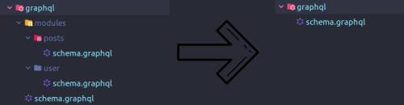

# GraphQL schema file merger

An utility tool for merging multiple GraphQL schemas into one single file.

Helps to accomplish modularized GraphQL schemas and better reusability.

The tool is most benefitial in projects that heavily utilize GraphQL schemas and follow the monorepo principle.

### Usage:

Clone the repo

    git clone git@github.com:Dzhuneyt/graphql-schema-merger.git ./graphql-schema-merger
    cd graphql-schema-merger

Run the script
    
    npm start -- --src=/path/to/project/**/*.graphql --outDir=/path/to/project/schema.graphql